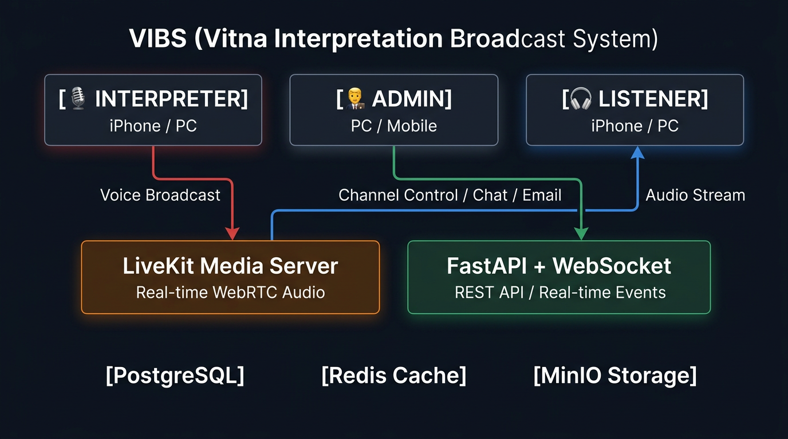
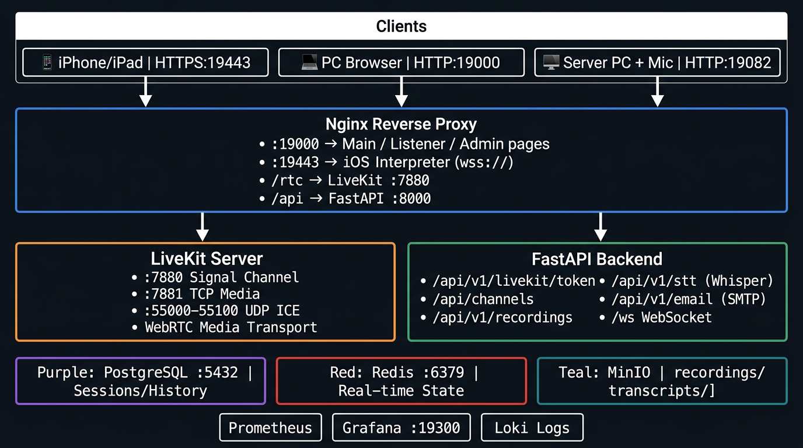
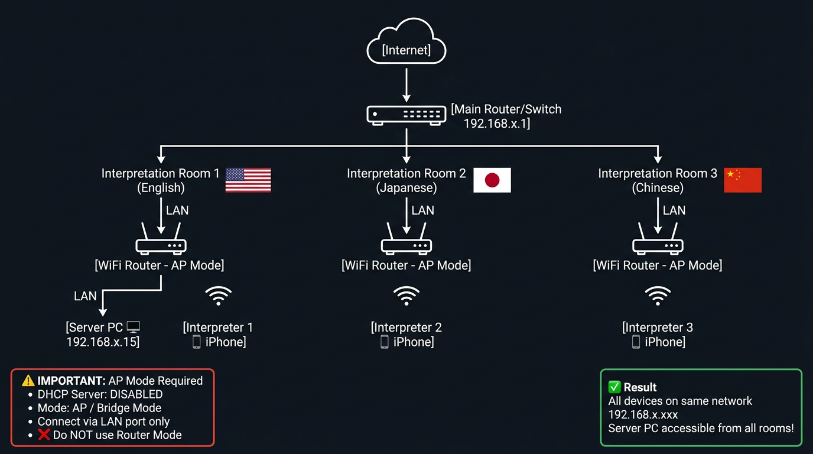

# 🎧 VIBS - Vitna Interpretation Broadcast System
## 다국어 실시간 통역 방송 시스템

> **교회/컨퍼런스/행사**에서 실시간 다국어 동시통역 방송을 위한 오픈소스 시스템
> iPhone · Android · PC 모든 기기에서 브라우저만으로 송출 및 청취 가능


## 📋 목차

1. [시스템 개요](#시스템-개요)
2. [아키텍처](#아키텍처)
3. [기술 스택](#기술-스택)
4. [설치 및 실행](#설치-및-실행)
5. [포트 구성](#포트-구성)
6. [페이지별 사용법](#페이지별-사용법)
7. [주요 기능](#주요-기능)
8. [IP 변경 대응](#ip-변경-대응)
9. [외부 도메인 접속](#외부-도메인-접속)
10. [네트워크 구성 가이드](#네트워크-구성-가이드)
11. [문제 해결](#문제-해결)
12. [개발 이력](#개발-이력)


## 🌐 시스템 개요



### 주요 특징

| 기능 | 설명 |
|------|------|
| 🎙️ 실시간 음성 방송 | WebRTC 기반 초저지연 음성 전송 |
| 📱 크로스플랫폼 | iPhone Safari · Android · PC Chrome 완전 지원 |
| 🌐 다국어 채널 | 영어·일어·중국어 + 신규 언어 동적 추가/삭제 |
| 💬 실시간 채팅 | 카카오톡 스타일 채팅 (날짜구분선·말풍선·아바타) |
| 🎛️ 마이크 선택 | 핸드폰 마이크 / 서버PC 전문마이크 선택 가능 |
| 🎙️ 음성 녹음 | 방송 자동 녹음 → MinIO 저장 |
| 📝 STT 변환 | Whisper AI로 음성→텍스트 자동 변환 (CPU) |
| 📄 Word 생성 | 타임스탬프 포함 Word 파일 자동 생성 |
| 📧 이메일 전송 | Word 파일 통역자 이메일 자동/수동 전송 |
| 🔊 음향 제어 | AEC·NS·AGC 하울링 방지 + 상황별 프리셋 |
| 📊 방송 이력 | DB 기반 방송 세션 기록 및 통계 |
| 📅 스케줄 관리 | 방송 스케줄 생성/수정/삭제/활성화 |


## 🏗️ 아키텍처




## 🛠️ 기술 스택

| 구분 | 기술 | 버전 | 역할 |
|------|------|------|------|
| **미디어 서버** | LiveKit | 1.13.0 | WebRTC 음성 송출/수신 |
| **백엔드** | FastAPI (Python) | 3.11 | REST API + WebSocket |
| **웹서버** | Nginx | 1.31 | 리버스 프록시 + SSL |
| **DB** | PostgreSQL | 17 + pgvector | 방송 세션 관리 |
| **캐시** | Redis | latest | 실시간 상태 관리 |
| **스토리지** | MinIO | latest | 녹음/Word 파일 저장 |
| **STT** | OpenAI Whisper | small | 음성→텍스트 변환 (CPU) |
| **문서생성** | python-docx | 1.1.2 | Word 파일 생성 |
| **이메일** | smtplib (SSL) | 내장 | 네이버 SMTP 이메일 전송 |
| **스케줄러** | APScheduler | 3.10.4 | 자동 전송 스케줄 |
| **인증** | Keycloak | latest | SSO 인증 |
| **모니터링** | Prometheus+Grafana | latest | 시스템 모니터링 |
| **컨테이너** | Docker Compose | latest | 전체 스택 관리 |


## 🚀 설치 및 실행

### 필수 요구사항

- Ubuntu 22.04 / Debian 11 이상
- Docker + Docker Compose
- 최소 RAM 4GB (Whisper small 모델), 저장공간 20GB
- 포트 개방: 19000, 19443, 17880, 17881, 55000-55100 (UDP)

### 1단계: 저장소 클론

```bash
git clone https://github.com/letschangeourworld/pythsm_study.git
cd pythsm_study/VIBS
```

### 2단계: 환경변수 설정

```bash
cp .env.example .env
vi .env
```

**.env 주요 설정:**

```env
# 서버 IP (현재 서버의 LAN IP)
SERVER_IP=192.168.0.15

# LiveKit 보안키 (32자 이상)
LIVEKIT_API_KEY=your_api_key
LIVEKIT_API_SECRET=your_32char_secret_key

# JWT 시크릿
JWT_SECRET=your_32char_jwt_secret_key

# 관리자 계정
ADMIN_USERNAME=admin
ADMIN_PASSWORD=your_password

# DB
POSTGRES_PASSWORD=your_db_password
REDIS_PASSWORD=your_redis_password

# MinIO
MINIO_ROOT_USER=minioadmin
MINIO_ROOT_PASSWORD=your_minio_password
MINIO_IP=172.31.0.4  # docker inspect ts_minio로 확인

# SMTP (네이버 메일)
SMTP_HOST=smtp.naver.com
SMTP_PORT=465
SMTP_USER=your_naver_id        # 아이디만 (@ 제외)
SMTP_PASSWORD=your_app_password # 네이버 앱 비밀번호
```

### 3단계: SSL 인증서 생성

```bash
mkdir -p configs/ssl/vitna
openssl req -x509 -nodes -days 3650 -newkey rsa:2048 \
  -keyout configs/ssl/vitna/key.pem \
  -out configs/ssl/vitna/cert.pem \
  -subj "/CN=localhost"
```

### 4단계: MinIO 버킷 생성

```bash
docker compose up -d minio
sleep 5
docker exec ts_minio mc alias set local http://localhost:9000 minioadmin your_password
docker exec ts_minio mc mb local/recordings
docker exec ts_minio mc mb local/transcripts
```

### 5단계: 실행

```bash
docker compose up -d
```

### 6단계: 상태 확인

```bash
docker compose ps
curl http://localhost:19000/api/health
```


## 🔌 포트 구성

| 포트 | 프로토콜 | 용도 | 접속 대상 |
|------|----------|------|-----------|
| **19000** | HTTP | 메인/청취자/관리자 | 모든 사용자 |
| **19443** | HTTPS | iOS 통역자 전용 (wss://) | iPhone 통역자 |
| **19080** | HTTP | 관리자 전용 | 관리자 |
| **19081** | HTTP | 청취자 전용 | 청취자 |
| **19082** | HTTP | 통역자(PC) 전용 | PC 통역자 |
| **17880** | TCP | LiveKit 신호채널 | LiveKit SDK |
| **17881** | TCP | LiveKit 미디어 TCP | LiveKit SDK |
| **55000-55100** | **UDP** | LiveKit ICE/미디어 | WebRTC |
| 19300 | HTTP | Grafana 모니터링 | 관리자 |
| 19011 | HTTP | MinIO 스토리지 | 관리자 |

> ⚠️ **UDP 55000-55100 포트 방화벽 개방 필수**


## 📱 페이지별 사용법

### 1. 메인 페이지 (청취자 입장)
```
[http://서버IP:19000](http://xn--ip-v41jw5m:19000/)
```
- 언어 채널 카드 (영어/일어/중국어 + 동적 추가 채널)
- ON AIR 채널 3초 이내 실시간 반영
- 채널 클릭 → 청취자 페이지 이동


### 2. 청취자 페이지
```
[http://서버IP:19000/listen.html?ch=english](http://xn--ip-v41jw5m:19000/listen.html?ch=english)
[http://서버IP:19000/listen.html?ch=japanese](http://xn--ip-v41jw5m:19000/listen.html?ch=japanese)
[http://서버IP:19000/listen.html?ch=chinese](http://xn--ip-v41jw5m:19000/listen.html?ch=chinese)
```

**사용 순서:**
1. 🎧 이어폰 연결 (하울링 방지 필수)
2. **[청취 시작]** 버튼 클릭 → 음성 청취
3. 카카오톡 스타일 채팅 참여

**기능:**
- 실시간 음성 청취 (WebRTC UDP)
- 카카오톡 스타일 채팅 (말풍선/아바타/날짜구분)
- 실시간 STT 자막 표시
- 볼륨 조절


### 3. 통역자 페이지

**PC:**
```
[http://서버IP:19082/pages/interpreter/index.html](http://xn--ip-v41jw5m:19082/pages/interpreter/index.html)
```

**iPhone/iOS:**
```
[https://서버IP:19443/pages/interpreter/index.html](https://xn--ip-v41jw5m:19443/pages/interpreter/index.html)
```
> ⚠️ iOS: 인증서 경고 → '고급' → '방문' 클릭

**사용 순서:**
1. 상단 **채널 선택** (영어/일어/중국어)
2. **마이크 소스 선택**
   - 📱 내 마이크: 현재 기기 마이크
   - 🖥️ 서버PC 마이크: 전문 마이크 장치 목록에서 선택
3. **[▶ 방송 시작]** 클릭 → 🔴 녹음 자동 시작
4. **[⏹ 방송 종료]** → 자동 STT 변환 → Word 저장 → 이메일 전송


### 4. 관리자 페이지
```
[http://서버IP:19000/admin.html](http://xn--ip-v41jw5m:19000/admin.html)
```

**기본 계정:** admin / admin123 (반드시 변경!)

| 메뉴 | 기능 |
|------|------|
| 📊 대시보드 | 채널 ON/OFF, KPI, 빠른 링크 |
| 📡 방송 관리 | 방송 이력, 통계 |
| 💬 채팅 | 공지 전송, 채팅 기록 |
| 🕐 스케줄 | 방송 스케줄 CRUD + 활성화 토글 |
| 🎛️ 음향 제어 | AEC/NS/AGC + 볼륨 + 상황별 프리셋 |
| 📧 이메일 전송 | 발신자/수신자 설정, 파일 선택, 자동전송 |


## ⭐ 주요 기능

### 🌐 동적 채널 관리
```
관리자 → 채널 추가:
채널 키: french
표시 이름: Français
국기: 🇫🇷
Room: room\_fr
→ 메인/관리자 페이지 즉시 반영
→ 채널 삭제 가능 (기본 3개 보호)
```

### 🔊 음향 제어 (하울링 방지)
```
상황별 프리셋:
⛪ 교회/예배당 → AEC ON · NS ON · 감도 75%
🏢 컨퍼런스홀 → AEC ON · NS ON · 감도 85%
🌳 야외 행사 → AEC ON · NS OFF · 감도 100%
🎙️ 스튜디오 → AEC OFF · NS OFF · 감도 90%

하울링 발생 시:

1. 에코 제거(AEC) ON 확인
2. 마이크 감도 낮추기 (100% → 70%)
3. 청취자 이어폰 사용 필수
4. 방송 재시작
```

### 🎙️ 자동화 파이프라인
```
\[방송 시작\]
└→ 자동 녹음 시작 (10초 청크 → MinIO)

\[방송 종료\]
└→ .webm 파일 MinIO 저장
└→ Whisper STT 변환 (백그라운드, CPU)
└→ Word 파일 생성 (타임스탬프 포함)
└→ MinIO transcripts/ 저장
└→ 설정 시간에 통역자 이메일 자동 전송
```

### 📧 이메일 관리
```
관리자 → 📧 이메일 전송:

1. 계정 설정:
    발신자: [your\_id@naver.com](mailto:your_id@naver.com)
    앱 비밀번호: (네이버 앱 비밀번호)

2. 수신자 설정 (채널별):
    영어 → [interpreter1@email.com](mailto:interpreter1@email.com)
    일본어 → [interpreter2@email.com](mailto:interpreter2@email.com)
    중국어 → [interpreter3@email.com](mailto:interpreter3@email.com)

3. 자동 전송:
    매주 일요일 오후 7:00 자동 전송

4. 수동 전송:
    파일 목록에서 선택 → 전송 버튼
```

### 💬 카카오톡 스타일 채팅
```
관리자/통역자 ← 금색 말풍선 (왼쪽) + 🎙️ 아바타
내 메시지 → 노란색 말풍선 (오른쪽, #FEE500)
시스템 알림 ─ 중앙 회색 알약
날짜 구분선 ─ "2026년 6월 14일"
```

### 📅 스케줄 관리
```
관리자 → 🕐 스케줄:
시간: 07:50
이름: 주일 1부 예배 (08:00)
요일: 일요일 선택
활성화: ON/OFF 토글
→ 생성 / 수정 / 삭제 / 활성화 모두 가능
```

### 📊 방송 이력
```
관리자 → 📡 방송 관리:
KPI: 전체 방송수 / 이번주 / 평균 시간
이력: 날짜 | 채널 | 제목 | 상태 | 방송시간

특징:

- 채널 토글 ON/OFF 시 DB 자동 기록
- 서버 재시작 시 미종료 LIVE 자동 정리
- 새 방송 시작 시 이전 LIVE 자동 종료
```


## 🔄 IP 변경 대응

```bash
# 새 망 연결 후 수동 실행
/opt/translation-system/scripts/update-ip.sh

# 또는 서버 재부팅 (자동 실행)
sudo reboot
```

**동작 순서:**
1. 192.168.x.x LAN IP 우선 감지
2. .env + livekit.yaml node_ip 자동 업데이트
3. LiveKit / API / Nginx 자동 재시작


## 🌐 외부 도메인 접속

```bash
# 1. DNS A레코드 설정
#    translate.vitna.net → 공인IP

# 2. 공유기 포트포워딩
#    80  → 서버IP:80
#    443 → 서버IP:443

# 3. SSL 인증서 자동 발급
sudo /opt/translation-system/scripts/setup-ssl.sh
```

## 📡 네트워크 구성 가이드

### 통역실 WiFi 구성 (AP 모드)



> ⚠️ **공유기는 반드시 AP 모드(브리지 모드) 사용**
> - 라우터 모드: ❌ IP 대역 분리 → 서버 접속 불가
> - AP 모드: ✅ 같은 네트워크 → 서버 접속 가능

### 동일 SSID 다른 IP 문제

같은 WiFi 이름에 연결했지만 서로 다른 IP 대역을 받는 경우:

| 장치 | IP 대역 | 원인 |
|------|---------|------|
| 서버PC | 192.168.3.x | 메인 공유기 |
| 핸드폰 | 192.168.3.x | 메인 공유기 ✅ |
| 노트북 | 192.168.0.x | 보조 공유기 ❌ |

**해결 방법:**
```
보조 공유기 관리자 페이지 (192.168.0.1)
→ DHCP 서버: OFF
→ 운영 모드: AP 모드
→ LAN 포트에 메인 랜선 연결
→ 모든 장치가 192.168.3.x 통일
```


## 🔧 문제 해결

### iOS "server was not reachable"
```bash
curl -sk -H "Upgrade: websocket" \
  -H "Connection: Upgrade" \
  https://서버IP:19443/rtc | head -3
# 401이면 정상
```

### 청취자 연결 실패 (ICE failed)
```bash
# LiveKit nodeIP 확인 (LAN IP여야 함)
docker logs ts_livekit 2>&1 | grep nodeIP | tail -1
# "nodeIP": "192.168.x.x" 확인

# Docker IP(172.x.x.x)면:
/opt/translation-system/scripts/update-ip.sh
```

### 음성 안 들림
```bash
# 통역자 방송 중인지 확인
docker logs ts_livekit --tail=5 | grep "mediaTrack published"
# 브라우저 강력 새로고침: Ctrl+Shift+R (PC), 주소창 새로고침 길게 누르기 (모바일)
```

### STT 변환 실패
```bash
docker exec ts_api python3 -c "import whisper; print('OK')"
docker exec ts_api ffmpeg -version | head -1
```

### 이메일 전송 실패
```bash
# 네이버 SMTP 직접 테스트
docker exec ts_api python3 -c "
import smtplib, ssl
s = smtplib.SMTP_SSL('smtp.naver.com', 465,
    context=ssl.create_default_context())
s.login('your_id@naver.com', 'app_password')
print('✅ 로그인 성공')
s.quit()
"
# 네이버 메일 → 환경설정 → POP3/IMAP → IMAP/SMTP 사용함 확인
```

### UDP 포트 방화벽
```bash
sudo ufw allow 55000:55100/udp
sudo ufw allow 17880/tcp
sudo ufw allow 19000/tcp
sudo ufw allow 19443/tcp
```

### MinIO 연결 실패
```bash
# MinIO IP 재확인
MINIO_IP=$(docker inspect ts_minio --format \
  '{{range .NetworkSettings.Networks}}{{.IPAddress}} {{end}}' \
  | tr ' ' '\n' | grep "172\." | head -1)
echo "MinIO IP: $MINIO_IP"

# .env 업데이트
sed -i "s/MINIO_IP=.*/MINIO_IP=${MINIO_IP}/" .env
docker compose restart api
```


## 📊 모니터링

| 서비스 | URL | 계정 |
|--------|-----|------|
| Grafana | http://서버IP:19300 | admin / 설정값 |
| MinIO | http://서버IP:19011 | minioadmin / 설정값 |


## 🗂️ 프로젝트 구조

````
VIBS/
├── backend/
│    ├── Dockerfile # ffmpeg + Whisper 포함
│    ├── requirements.txt # 의존성 패키지
│    └── app/
│    ├── main.py # FastAPI + lifespan (LIVE세션 자동정리)
│    ├── config.py # 환경변수
│    ├── database.py # AsyncSessionLocal
│    └── routers/
│    ├── websocket\_router.py # WebSocket + 채널관리 API
│    ├── livekit\_router.py # LiveKit 토큰 발급
│    ├── broadcasts.py # 방송 세션 (DB)
│    ├── recordings.py # 음성 녹음 + MinIO
│    ├── stt\_router.py # Whisper STT + Word 생성
│    └── email\_router.py # 이메일 전송 (Naver SMTP)
├── frontend/
│    ├── index.html # 메인 (동적 채널 카드)
│    ├── listen.html # 청취자 (카카오톡 채팅)
│    ├── admin.html # 관리자 (풀기능 + 모바일 탭바)
│    ├── login.html # 로그인
│    └── pages/
│         └── interpreter/
│         └── index.html # 통역자 (녹음+STT+마이크선택)
├── configs/
│    ├── nginx/conf.d/
│    │    ├── 00-main.conf # HTTP :19000
│    │    └── 19443-https.conf # HTTPS + /rtc LiveKit 프록시
│    ├── livekit/
│    │    └── livekit.yaml # node\_ip: LAN IP 설정
│    └── ssl/vitna/ # SSL 인증서
├── scripts/
│    ├── update-ip.sh # IP 자동 감지/적용
│    └── setup-ssl.sh # Let's Encrypt SSL 발급
├── sql/ # DB 스키마
├── docker-compose.yml
└── .env # 환경변수 (gitignore)
```


## 🔐 보안 주의사항

1. `.env` 파일은 절대 Git에 올리지 마세요
2. 프로덕션 환경에서는 Let's Encrypt SSL 인증서 사용
3. 관리자 기본 비밀번호(`admin123`) 반드시 변경
4. LiveKit API Secret은 32자 이상 랜덤 문자열 사용
5. 네이버 앱 비밀번호는 정기적으로 갱신
6. MinIO는 외부 포트 노출 최소화


## 📝 개발 이력

| 날짜 | 주요 변경사항 |
|------|--------------|
| 2026.06.06 | 초기 시스템 구축 (FastAPI + LiveKit + Nginx) |
| 2026.06.13 | iOS 통역자 wss:// 연결 문제 해결 |
| 2026.06.13 | 청취자 버튼 클릭 시에만 오디오 재생 |
| 2026.06.13 | 채널 선택 / 신규 채널 추가 / 마이크 소스 선택 |
| 2026.06.13 | 관리자 페이지 반응형 레이아웃 (모바일 탭바) |
| 2026.06.14 | 청취자 ICE 연결 실패 해결 (node_ip/포트 수정) |
| 2026.06.14 | 카카오톡 스타일 채팅 UI |
| 2026.06.14 | iOS Safari 청취자 페이지 404 해결 |
| 2026.06.14 | IP 자동 감지 스크립트 (update-ip.sh) |
| 2026.06.14 | 음성 녹음 → MinIO 저장 |
| 2026.06.14 | Whisper STT + Word 파일 자동 생성 |
| 2026.06.14 | 방송 이력 DB 연동 + 통계 |
| 2026.06.20 | iPhone to iPhone 테스트 성공 |
| 2026.06.20 | LiveKit nodeIP Docker IP → LAN IP 수정 |
| 2026.06.20 | 음향 제어 패널 (AEC/NS/AGC + 프리셋) |
| 2026.06.20 | 스케줄 관리 CRUD |
| 2026.06.20 | 이메일 전송 UI (발신자/수신자 설정, 자동전송) |
| 2026.06.20 | 채널 삭제 기능 |
| 2026.06.20 | 방송 이력 LIVE 세션 자동 정리 |
| 2026.06.20 | 동적 채널 복원 (페이지 새로고침 시) |
| 2026.06.21 | VIBS로 프로젝트명 변경 (Vitna IBS → VIBS) |
| 2026.06.21 | 네트워크 구성 가이드 추가 (AP모드/IP충돌 해결) |


## 📄 라이선스

MIT License


*VIBS - Vitna Interpretation Broadcast System*
*© 2026 Vitna. All rights reserved.*
